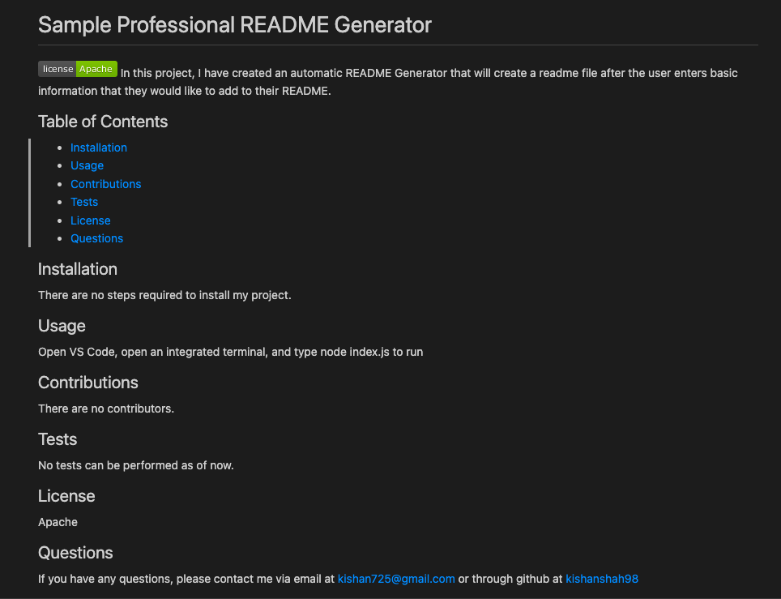

# Professional README Generator

This application provides the user with several questions including the title, description, installation, and many more in regards to their application. Using this input, this README Generator will automatically create a README file for the user with all the answers that they inputted. The main goal of this application is for users to improve the efficiency of creating a README while they work on their own applications so that they can spend more time on the code for their application instead of working on a README document. This Professional README Generator uses Javascript and Node.js.

## Screenshot of sample README file created

## Link to Screencastify Walkthrough

[Screencastify link](https://drive.google.com/file/d/1UmIXb2Wz2F7Ci3-VS4GCOOL8civI_tSg/view)
